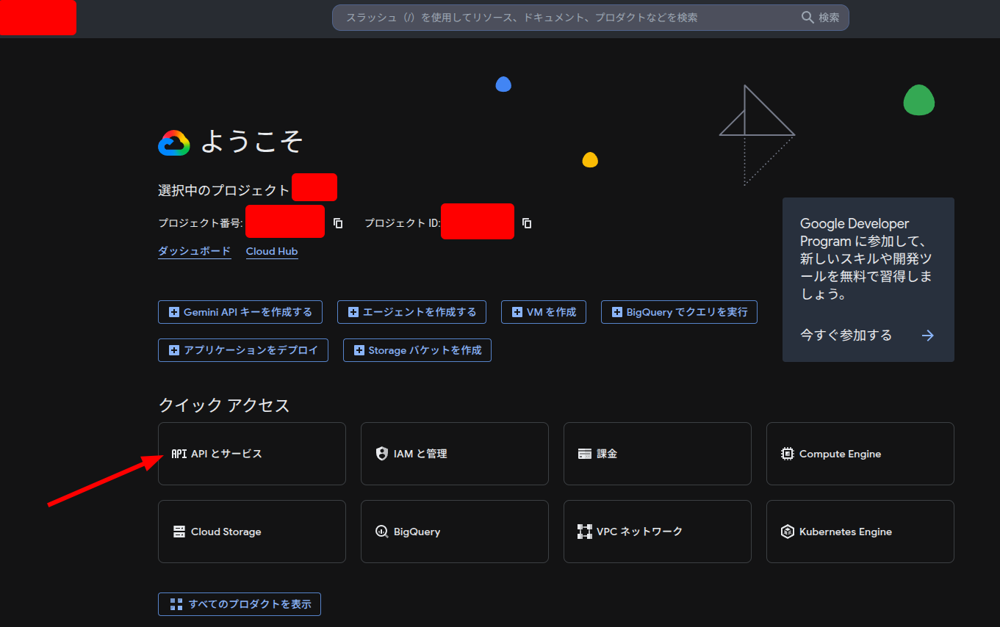
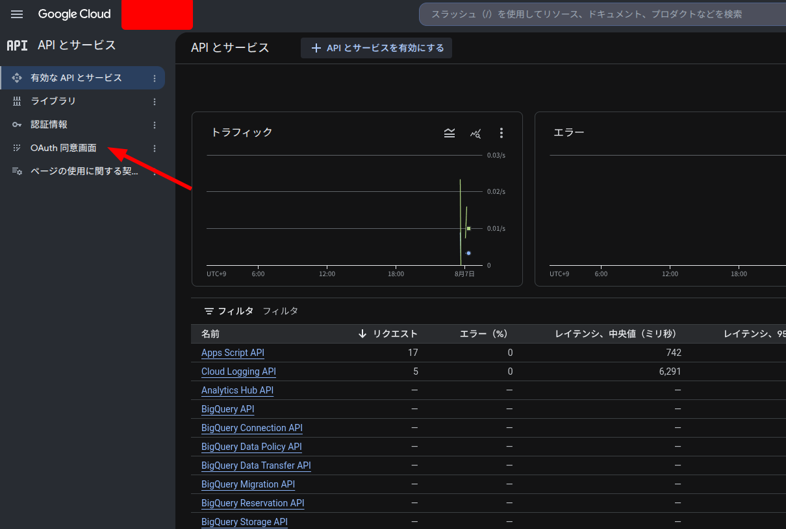
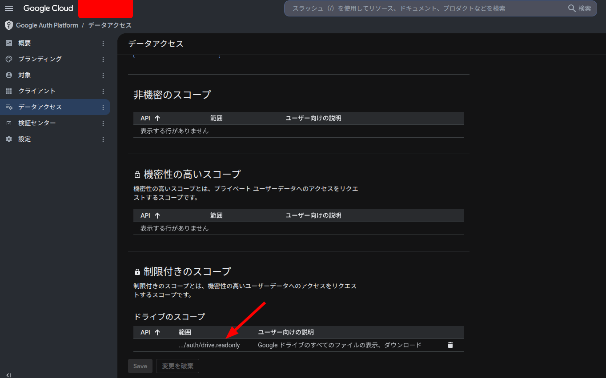
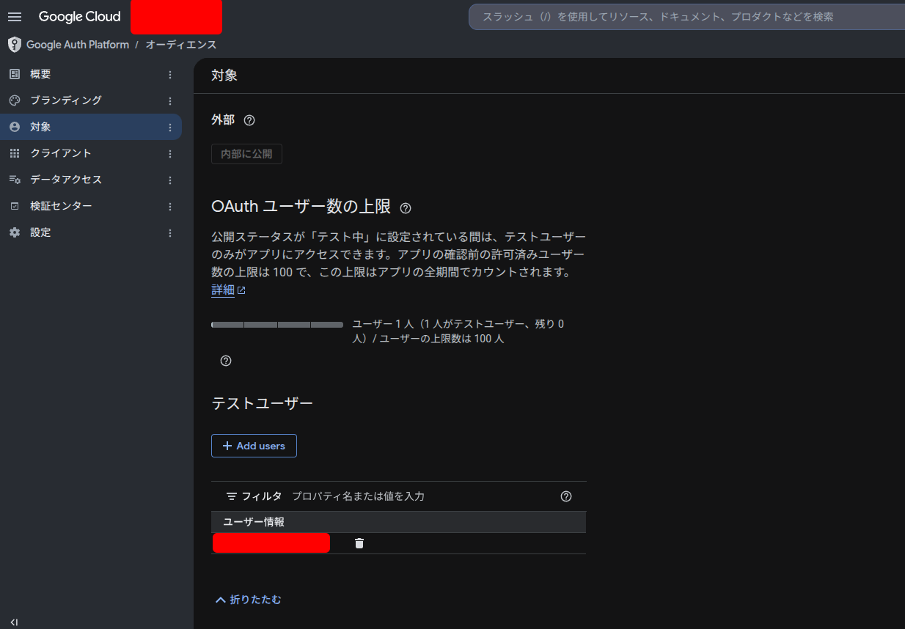
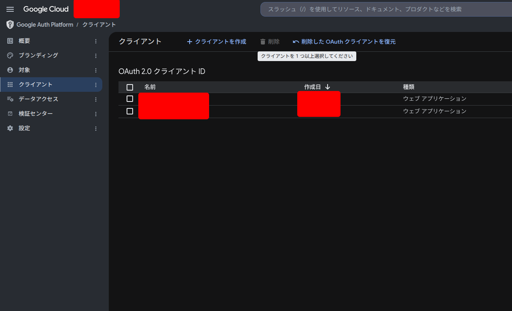

# Initial setup for project environment and credentials

The Agent must proceed interactively when the user needs to set up Google Cloud Platform in the browser.

## npm

If `npm` is not found, terminate this task and install `npm` first.

## Install packages and set `PATH`

```bash
npm install
```

Set the `PATH` according to your shell.

```bash
export PATH=$PATH:./node_modules/.bin
```

```fish
fish_add_path ./node_modules/.bin/
```

### Enable pull/push from/to GAS

The Agent must ask the user for the script ID appearing in the URL `https://script.google.com/u/0/home/projects/`, and refer to it as `<scriptId>` for the corresponding placeholder in later tasks.

Run the following to pull the project from `<scriptId>`.

```bash
clasp login
clasp clone <scriptId>
```

After pulling from remote, adjust the structure as follows.

> [!NOTE]
> Depending on the clasp version, the pulled script file may be named `code.js` or `index.js` — check what was actually cloned before removing.

```bash
mkdir dist
mv appsscript.json dist
rm code.js   # or index.js — remove whatever stale script file clasp clone produced
```

Then update `.clasp.json` as follows.

```json
{
  "scriptId": "<scriptId>",
  "rootDir": "./dist",
  "fileExtension": "js"
}
```

After editing, verify with `clasp show-file-status` that `dist/index.js` (or your webpack output filename) appears under "Tracked files", not "Untracked files".

## Set up GCP

First, the user needs to create a new GCP project and download its credentials as `creds.json`, following the steps below.

### Create project and enable APIs

The user will select and enable the `Google Apps Script` API and others. The Agent must assist the user by referring to `docs/gas-setting.md`.



### Set up OAuth

This part is performed by the user.

Refer to [this guide](https://qiita.com/BONZINE/items/d296e7364dafd553591f#gcp%E3%83%97%E3%83%AD%E3%82%B8%E3%82%A7%E3%82%AF%E3%83%88%E3%81%AE%E8%A8%AD%E5%AE%9A).



Add the scope <https://www.googleapis.com/auth/drive.readonly>.



Add a test user with the user's email.



Create an OAuth client.



Download the credentials JSON as `creds.json`.

### Integrate Apps Script with GCP

The user will open the Apps Script "Project Settings" page and enter the GCP project number. The user also needs to note the GCP project ID as `<projectId>` for the next step.

## Integrate and authorize with GCP to call remote functions

Add a `projectId` field to `.clasp.json`.

```json
{
  "scriptId": "<scriptId>",
  "rootDir": "./dist",
  "fileExtension": "js",
  "projectId": "<projectId>"
}
```

> [!NOTE]
> clasp v3 removed the `clasp setting` subcommand — there is no `clasp setting projectId` anymore. Instead, add a `"projectId": "<projectId>"` field directly to `.clasp.json` (this is exactly what the old subcommand used to write on your behalf).

Then get/update `.clasprc.json` by running `clasp login --creds creds.json --use-project-scopes --include-clasp-scopes` and authorizing the app in the browser using the user's Google account. This cannot be driven through a non-interactive tool call — ask the user to run it themselves in their own terminal, and once finished, verify with `clasp show-authorized-user`.

## Validate permission scopes

This section is still in progress.

Refer to `docs/gas-setting.md` and check whether `dist/appscript.json`, `~/.clasprc.json`, etc. are consistent with the required permissions.

For example, the following field may be needed in `dist/appscript.json`, although it isn't required when using `clasp`'s `--use-project-scopes --include-clasp-scopes` options.

```json
  "oauthScopes": [
    "https://www.googleapis.com/auth/spreadsheets.currentonly",
    "https://www.googleapis.com/auth/spreadsheets"
  ]
```

## Verification

Now we're ready to call a specified GAS function without opening the editor in the browser. Verify the whole pipeline end-to-end before considering setup complete:

```bash
npm run build
clasp push
clasp run-function main   # or whatever function exists
clasp tail-logs           # logs may take up to ~20s to propagate; retry if empty
```
